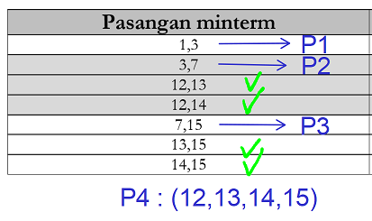

# logicMinimization
Tugas besar mata kuliah `EL2008 : Pemecahan masalah dengan C` terkait minimalisasi logic

#### Anggota Kelompok:
1. Jefferson Grizzlie (13220013)
2. Muhammad Mikhail Ghrilman (13220021)
3. Bostang Palaguna (13220055)
4. Muhammad Daffa Rasyid (13220059)

### Perintah

1. Eksplorasi algoritma minimisasi logic
2. Rancanglah sebuah simulator untuk menggambarkan kerja sistem tersebut
    - Buat deskripsi simulasi. Deskripsikan dengan jelas: input - proses – output 
    - Lengkapi deskripsi di atas dengan algoritma dalam bentuk flowchart untuk setiap fungsi-fungsi dalam sistem
    - Buat Data Flow Diagram (DFD)
3. Berdasarkan rancangan simulasi dan algoritma yang telah dibuat pada tugas sebelumnya, buatlah program dalam bahasa pemrograman C untuk menjalankan simulasi tersebut.

---

## Penjelasan metode Tabular
### Permasalahan
Misalkan kita memilki sebuah fungsi logika untuk di-minimisasi sebagai berikut:

atau dalam bentuk kanonikal:

> catatan : variabel dengan huruf kecil menunjukkan komplemen dari variabel huruf besar. Sedangkan variabel huruf besar bernilai _logic 1_.

### Solusi

Tahapan metode tabular secara garis besar dibagi menjadi dua, yaitu mencari prime implicant kemudian menemukan minimum cover.

#### Langkah Pertama : Membuat L1 dengan mengurutkan term berdasarkan banyak angka **1**

Kita akan kelompokkan minterm berdasarkan banyaknya angka **1** yang mereka punya dalam representasi binernya. Kita akan bagi menjadi grup yang memiliki satu angka **1**, dua angka **1**, sampai dengan empat angka **1**.

Kita mengelompokkan term berdasarkan banyaknya angka **1** yang mereka punya sehingga ketika mencari pasangan minterm yang hanya berbeda satu term, kita cukup membandingkan minterm-minterm pada grup yang bersebelahan. Misalkan minterm-minterm pada grup dengan banyak angka **1** sebanyak 1 cukup dibandingkan dengan minterm pada grup dengan banyak angka **1** sebanyak 2. Tidak perlu membandingkannya dengan minterm pada grup dengan banyak angka **1** sebanyak tiga ataupun empat. 

#### Langkah kedua : kelompokkan minterm pada L1 yang hanya berbeda satu term

Contoh minterm yang dipasangkan (yang hanya berbeda satu term) adalah minterm ke-3 dan minterm ke-7.

Dengan menemukan semua pasangan minterm pada L1 (ingat kita hanya membandingkan minterm-minterm pada grup yang bersebelahan saja), kita akan peroleh L2 sebagai berikut:

> catatan:
 > 1.  \- menandakan don't care
 > 2. minterm yang bisa dipasangkan grup ke-$n$ dan grup ke-$n+1$ pada L1 akan bergabung menjadi pasangan minterm dengan grup ke-$n$ pada L2

perhatikan bahwa semua minterm pada L1 telah ter-_cover_ oleh pasangan minterm pada L2, sehingga kita tidak lagi membutuhkan L1.

#### Langkah ketiga : kelompokkan pasangan minterm pada L2 yang hanya berbeda satu term

Kita lakukan cara yang sama untuk membentuk L3 dari L2 seperti membentuk L2 dari L1. Kita pasangkan 'pasangan minterm' pada L2 yang hanya berbeda satu term. Kita peroleh L3 sebagai berikut:

perhatikan bahwa (12,13;14,15) memiliki representasi biner yang sama dengan (12,14;13,15) sehingga kita cukup mengambil salah satu. Misalkan kita ambil (12,13;14,15) sebagai prime implicant.

#### Langkah keempat : Bentuk prime implicant dari L2 dan L3

(12,13,14,15) pada L3 telah men-_cover_ pasangan minterm (12,13), (12,14), (13,15), dan (14,15) pada L2. pasangan minterm yang belum tercover pada L2 adalah (1,3), (3,7), dan (7,15). Maka dari L2 dan L3, kita punya prime implicant P1, P2, P3, dan P4 sebagai berikut:

#### Langkah kelima : Cari minium cover dari prime implicant yang telah dibentuk

Kita buat sebuah tabel dengan baris (vertikal) berisi prime implicant P1 sampai dengan P4 lalu kolom (horizontal) berisi minterm ke-1 sampai dengan minterm ke 15 (sesuai fungsi logika).

sekarang kita harus memilih prime implicant se-sedikit mungkin sehingga semua minterm tercover. Perhatikan bahwa agar m1 tercover, mau tidak mau P1 harus dipilih. Selanjutnya, semua yang tercover oleh P1 bisa kita hiraukan.

selanjutnya, agar m12 dan m13 tercover, kita harus memilih P4. Maka kita peroleh tabel minimum cover yang lebih sederhana sebagai berikut:

terakhir, untuk men-_cover_ m7, kita bisa bebas memilih P2 ataupun P3. Kedua pilihan sama baiknya. Misalkan untuk sekarang kita pilih P2. Maka semua minterm telah tercover dan kita peroleh fungsi logika yang telah di-minimisasi sebagai berikut:

---

### don't care

> sekarang bagaimana jika terdapat `don't care`?

don't care adalah term yang boleh di-cover ataupun tidak. Ia membantu kita dalam memberikan ekspresi logika hasil minimisasi yang lebih sederhana.

Sebagai contoh permasalahan, misalkan kita diminta untuk meminimisasi fungsi logika:

sama seperti sebelumnya, kita bentuk L1, L2, dan L3 dengan cara yang sama.

semua minterm pada L1 telah ter-cover oleh pasangan minterm pada L2 sehingga L1 tidak akan kita gunakan. Pasangan 'pasangan minterm' pada L3 (5,7,13,15) telah mencover pasangan minterm (5,7), (5,13), (7,15), dan (13,15) pada L2. Sedangkan yang belum tercover adalah pasangan minterm (11,15) dan (14,15).

Maka kita punya prime implicant : P1 (11,15), P2 (14,15), dan P3 (5,7,13,15).

Sekarang yang membedakan `don't care` dengan minterm biasa adalah pada saat pencarian minimum cover, `don't care` tidak perlu masuk sebagai kolom (horizontal). Berikut adalah tabel minimum covernya:

P3 harus dipilih agar m7 dan m13 tercover.

selanjutnya agar m14 tercover, kita pilih P2. Maka kita peroleh fungsi logika yang telah diminimisasi:

